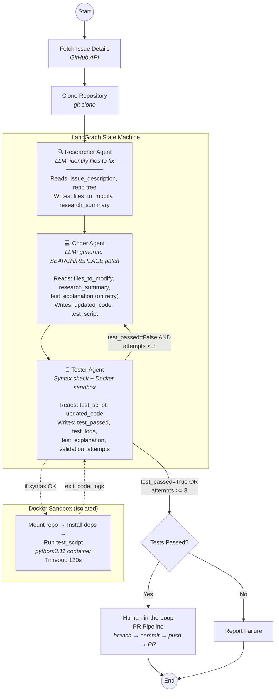

<p align="center">
  
</p>

<div align="center">
  
  
  
  
  <a href="https://www.gnu.org/licenses/agpl-3.0"></a>
</div>

---

<div align="center">
  <h3>Autonomous Multi-Agent Orchestrator For GitHub Issues</h3>
  <a href="https://github.com/NinadAmane/Ghost-Coder">
    
  </a>
</div>


---

**Ghost Coder** is an experimental autonomous agent that attempts to resolve GitHub issues end-to-end. You paste a GitHub Issue URL into a dashboard, and a team of AI agents collaborates to clone the repository, identify the relevant file, generate a patch, and run the generated tests inside an isolated Docker sandbox. If the tests pass, it opens a Pull Request for your review.

> **Note:** Ghost Coder is a research prototype. It works best on well-scoped, single-file bugs in Python repositories. It does not guarantee correctness — all patches are proposed as Pull Requests for human review. See [Limitations](#-limitations) below.

---

## 📑 Table of Contents

- [⚡ Quick Start & Installation](#-quick-start--installation)
- [🏗️ System Architecture](#-system-architecture)
- [🛠️ Technology Stack](#-technology-stack)
- [🌱 Env Variables](#-env-variables)
- [🧪 Testing & Coverage](#-testing--coverage)
- [📊 Observability](#-observability)
- [⚠️ Limitations](#-limitations)
- [👨‍💻 Developers & Troubleshooting](#-developers--troubleshooting)
- [🙌 Contributing](#-contributing)
- [📄 License](#-license)

---

## ⚡ Quick Start & Installation

### Prerequisites
- Python 3.11+
- [Docker Desktop](https://www.docker.com/products/docker-desktop/) installed and running
- Groq API Key and GitHub PAT

### Installation
Ghost Coder supports installation via [uv](https://github.com/astral-sh/uv) (recommended for speed) or standard `pip`.

1. **Clone the repository**
   ```bash
   git clone https://github.com/NinadAmane/Ghost-Coder.git
   cd Ghost-Coder
   ```

2. **Install dependencies**

   **Using uv (Recommended):**
   ```bash
   uv sync
   source .venv/bin/activate  # Windows: .venv\Scripts\activate
   ```

   **Alternative using standard pip:**
   ```bash
   python -m venv .venv
   source .venv/bin/activate  # Windows: .venv\Scripts\activate
   pip install -e .[dev]
   ```

---

## 🏗️ System Architecture

Ghost Coder is built on a modular, multi-agent state-machine architecture powered by **LangGraph**. The workflow runs a `Researcher → Coder → Tester` loop, retrying up to 3 times if tests fail.



### Key Design Decisions

- **Retry loop**: The `Tester → Coder` feedback loop runs up to 3 times. On retry, the Coder receives the Tester's failure explanation to guide its next attempt.
- **Pre-flight syntax check**: Before spinning up a Docker container, the Tester runs `py_compile` on all modified files and the test script. This catches syntax errors instantly without the Docker overhead.
- **Sandbox isolation**: All generated test scripts run inside a Docker container with the repo mounted at `/app`. The container installs project dependencies automatically from `requirements.txt` / `pyproject.toml`.
- **SEARCH/REPLACE patching**: The Coder generates minimal diffs using a `<<<<<<< SEARCH / ======= / >>>>>>> REPLACE` format. If the LLM fails to produce valid blocks, it falls back to a full-file rewrite.

---

## 🛠️ Technology Stack

| Component           | Technology                       | Function                                    |
| :------------------ | :------------------------------- | :------------------------------------------ |
| **Brain**           | Groq (`llama-3.3-70b-versatile`) | High-speed reasoning and code generation    |
| **Orchestration**   | LangGraph & LangChain            | Multi-agent state machine with retry loop   |
| **Frontend**        | Streamlit                        | Live agent-thought UI with metrics dashboard|
| **Sandbox**         | Docker SDK                       | Isolated, dependency-aware code execution   |
| **Version Control** | PyGithub & Git                   | Automated branch and Pull Request creation  |
| **CI/CD**           | GitHub Actions                   | Pytest + coverage gate (80% on `src/`)      |
| **Logging**         | Python `logging` (JSON format)   | Structured, machine-readable log output     |

---

## 🌱 Env Variables

The following environment variables are required for full functionality. You can input them in the Streamlit Sidebar or set them in a `.env` file at the root of the project.

| Variable | Description | Source |
| :--- | :--- | :--- |
| `GROQ_API_KEY` | API Key for Llama-3 reasoning | [Groq Console](https://console.groq.com/keys) |
| `GITHUB_TOKEN` | Personal Access Token for repo access | [GitHub Settings](https://github.com/settings/tokens) |

---

## 🧪 Testing & Coverage

The test suite covers unit tests for each agent node, parsing utilities, tools, and integration tests for the full LangGraph state machine.

```bash
# Run the full test suite with coverage report
pytest tests/ -v --cov=src --cov-report=term-missing

# Run only unit tests (fast, no Docker needed)
pytest tests/ -v -k "not integration"

# Run integration tests only
pytest tests/ -v -k "integration"
```

### What's tested

| Area | Tests | What's verified |
|------|-------|-----------------|
| **Researcher** | 6 tests | FILE: marker parsing, missing marker handling, LLM exceptions, token tracking |
| **Coder** | 8 tests | SEARCH/REPLACE parsing & application, fallback rewrite, empty input, file-not-found, directory traversal, retry context |
| **Tester** | 7 tests | No-script handling, syntax check, Docker success/failure, Docker unavailable, LLM explanation fallback |
| **Graph Integration** | 8 tests | Full success path, retry-then-success (real graph transitions), max-retry exhaustion, `should_continue` routing |
| **Docker Sandbox** | 6 tests | Success, timeout, unavailable, cleanup, image-not-found |
| **GitHub Tools** | 9 tests | URL parsing (valid/malformed), file read (text/binary/missing), tree listing, issue fetch, clone |
| **Metrics & Logging** | 10 tests | Latency recording, token tracking, JSON formatting, serialization |

> **Coverage gate**: CI enforces ≥80% coverage on all code under `src/`. The current verified coverage is **93.24%** across all orchestration logic, agents, tools, and error-handling paths. See [ci.yml](.github/workflows/ci.yml).

---

## 📊 Observability

### Structured Logging
All internal logging uses Python's `logging` module with a JSON formatter. No `print()` statements remain in `src/`. Logs include:
- Timestamped events per node (start, complete, error)
- LLM token usage per call
- Docker sandbox lifecycle events
- Structured `extra` fields: `node`, `file_path`, `attempt`, `duration_ms`

### Metrics Dashboard
The Streamlit dashboard displays per-run metrics in the right panel:
- **Total run duration** and **per-node latency** breakdown
- **Validation attempts** count
- **Total LLM tokens** consumed
- **Estimated cost** (configurable `$/1M tokens` rate in sidebar)
- **Per-node success/failure** with expandable error details

Metrics are scoped per-run (fresh `RunMetrics` instance per orchestration call) and stored in Streamlit session state — no cross-session leakage.

---

## ⚠️ Limitations

- **Single-file focus**: The Researcher typically identifies one file. Multi-file bugs may not be fully addressed.
- **Python only**: The Docker sandbox runs `python test_fix.py`. Non-Python repos are not supported.
- **LLM-dependent correctness**: Patches are generated by an LLM and may be incorrect, incomplete, or introduce new bugs. All patches are proposed as PRs for human review.
- **No guarantee of fix quality**: The generated test script is also LLM-authored. A passing test does not prove the fix is correct — it proves the LLM's test passes against the LLM's patch.
- **Docker required**: The Tester agent requires a running Docker daemon. Without Docker, only the pre-flight syntax check runs.
- **Rate limits**: Groq API rate limits may cause retries or failures on rapid successive runs.
- **Retry limit**: The system retries up to 3 times. Complex bugs may require more iterations or manual intervention.

---

## 👨‍💻 Developers & Troubleshooting

### Running Tests
```bash
pytest tests/ -v --cov=src --cov-report=term-missing
```

<details>
<summary>⚠️ Troubleshooting Common Errors</summary>

**Docker Connection Refused**
Ensure Docker Desktop is running and the Docker daemon is accessible to your terminal.

**ModuleNotFoundError in Sandbox**
If the agent fails to find a library (like pandas), ensure the target repository has a `requirements.txt`. The Docker Sandbox will automatically parse it and install dependencies before running the test.

**Groq Rate Limits**
If you encounter `429 Too Many Requests`, the system will automatically retry, but you may need to check your Groq usage tier.
</details>

---

## 🙌 Contributing

We welcome contributions! Please see our contributing guidelines for more details.

### Contributors
<a href="https://github.com/NinadAmane/Ghost-Coder/graphs/contributors">
  
</a>

---

## 📄 License
This project is licensed under the **GNU AGPLv3 License**. See the [LICENSE](LICENSE) file for details.

---

## 🤝 Credits

Architected and developed by **Ninad Amane**.

[](https://github.com/NinadAmane)
[](https://www.linkedin.com/in/ninad-amane/)
