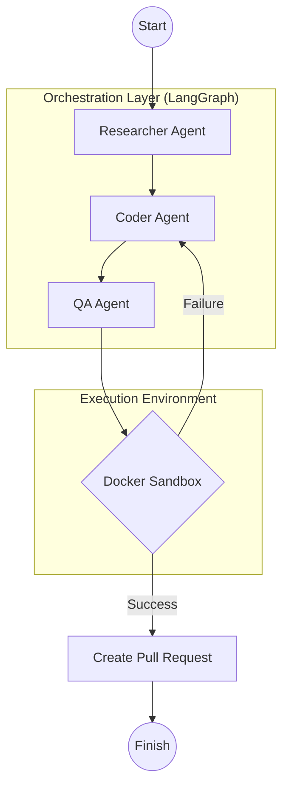

# Ghost Coder | Ghost Coder: Multi-Agent Orchestrator for Git Issues


**Ghost Coder** is a professional-grade Automated Software Engineering (ASE) platform designed to autonomously resolve GitHub issues. By leveraging a multi-agent orchestration layer powered by **LangGraph** and high-speed **Groq LLMs**, Ghost Coder researches repositories, implements code fixes across multiple languages, and validates changes within isolated **Docker sandboxes**.

---

## 🌟 Key Features

- 🔍 **Autonomous Research**: A dedicated Researcher agent that deep-dives into codebases using `list_files` and `read_file` to pinpoint root causes with surgical precision.
- 💻 **Polyglot Coding**: Supports **Python, Rust, Node.js, and Go**. The Coder agent understands complex project structures and applies multi-file fixes directly to the workspace.
- 🧪 **Dynamic Docker Sandbox**: Automatically detects repository language and spins up isolated containers (`rust:latest`, `node:18`, etc.) to run verification tests without risking host environment safety.
- 📊 **Real-Time Orchestration UI**: A sleek **Streamlit** dashboard providing full transparency into agent "thoughts," source code analysis, and live test execution logs.
- 🚢 **Automated PR Workflows**: Once tests pass, the system can automatically branch, commit, and open a Pull Request on GitHub for final human review.

---

## 🏗️ System Architecture

Ghost Coder utilizes a state-machine driven architecture where agents collaborate in a directed loop to ensure high-fidelity fixes.



---

## 🛠️ Tech Stack

| Component           | Technology                          |
| :------------------ | :---------------------------------- |
| **Brain**           | Groq (Llama-3.3-70B / Mixtral-8x7B) |
| **Orchestration**   | LangGraph & LangChain               |
| **Frontend**        | Streamlit                           |
| **Sandbox**         | Docker SDK                          |
| **Version Control** | PyGithub & Git                      |
| **Environment**     | UV (Python Package Manager)         |

---

## 🚀 Getting Started

### 1. Prerequisites

- Docker Desktop installed and running.
- [UV](https://github.com/astral-sh/uv) installed.
- Groq API Key & GitHub Personal Access Token.

### 2. Installation

```bash
git clone https://github.com/your-repo/ghost-coder.git
cd ghost-coder
uv sync
```

### 3. Configuration

Create a `.env` file in the root:

```env
GROQ_API_KEY=your_key_here
GITHUB_TOKEN=your_token_here
```

### 4. Run the Orchestrator

```bash
uv run streamlit run app.py
```

---

## 🤝 Credits

Developed with ❤️ by **Ninad Amane**.

_Transforming software development through agentic intelligence._
