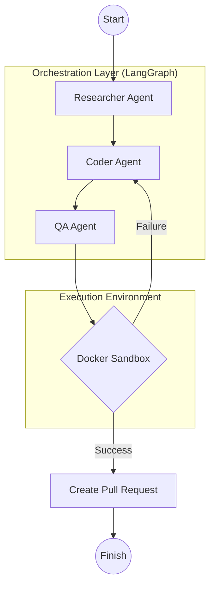

# 👻 Ghost Coder | Fully Autonomous Multi-Agent Orchestrator

[](#)
[](#)
[](#)
[](#)
[](#)
[](#)

**Ghost Coder** is a professional-grade Automated Software Engineering (ASE) platform designed to autonomously resolve GitHub issues entirely end-to-end.

By leveraging a multi-agent orchestration layer powered by **LangGraph** and high-speed **Groq LLMs**, Ghost Coder actively researches repositories using integrated RAG codebase search, writes code fixes across multiple languages, validates those changes within isolated **Docker sandboxes**, and automatically creates Pull Requests—all while streaming its live "thoughts" to a beautiful Streamlit UI.

---

## 🌟 Advanced Autonomous Features

- 🔍 **ReAct Researcher Agent**: Unlike basic scripted agents, Ghost Coder's Researcher utilizes a dynamic "Reasoning and Acting" (ReAct) loop. It independently decides _which_ tools to use, actively traversing the repository step-by-step.
- 🧠 **ChromaDB Local RAG Search**: Instead of blindly reading massive files, the system embeds the repository locally using HuggingFace Sentence Transformers and ChromaDB, allowing the agent to semantically query specific bugs or logic flows instantly and jump straight to the relevant file.
- 💻 **Secure Polyglot Coding**: Supports **Python, Rust, Node.js, and Go**. The Coder agent understands complex project structures and applies multi-file fixes, guarded by strict anti-path-traversal security rules.
- 🧪 **Reflective QA Sandbox**: Automatically detects repository language and spins up isolated containers to run verification tests. If a test fails, the QA agent captures the `stderr` logs, reflects on _why_ it failed, and routes the failure analysis back to the Coder for another iteration.
- 🛡️ **API Rate-Limit Resilience**: Includes custom exception handling to gracefully pause and alert the Streamlit UI without crashing when hitting LLM vendor rate limits during deep iterative loops.
- 🚢 **1-Click Auto-PR Deployments**: Once the Sandbox verifies a test passes, the built-in GitHub API integration dynamically commits the changes, pushes to a fresh remote branch, and opens a Pull Request automatically.

---

## 🏗️ System Architecture

Ghost Coder utilizes a state-machine driven architecture built on **LangGraph**. The workflow acts as a living cycle where agents collaborate, test, and loop until a solution is mathematically validated.



---

## 🛠️ Technology Stack

| Component           | Technology                       | Function                                    |
| :------------------ | :------------------------------- | :------------------------------------------ |
| **Brain**           | Groq (`llama-3.3-70b-versatile`) | High-speed reasoning and code generation    |
| **Orchestration**   | LangGraph & LangChain            | Multi-agent state machine looping           |
| **Memory / RAG**    | ChromaDB & Sentence Transformers | Semantic codebase search and embedding      |
| **Frontend**        | Streamlit                        | Live, streaming agent-thought UI            |
| **Sandbox**         | Docker SDK                       | Secure, language-agnostic code execution    |
| **Version Control** | PyGithub & Git                   | Automated branch and Pull Request creation  |
| **CI/CD**           | GitHub Actions                   | Automated Pytest validation & Docker builds |

---

## 🚀 Getting Started

### 1. Prerequisites

- **Docker Desktop** installed and running (Required for the testing sandbox).
- Python 3.11+
- Groq API Key & GitHub Personal Access Token.

### 2. Installation

```bash
# Clone the repository
git clone https://github.com/NinadAmane/Ghost-Coder.git
cd Ghost-Coder

# Create and activate a virtual environment
python -m venv .venv
source .venv/bin/activate  # Or `.venv\Scripts\activate` on Windows

# Install all dependencies (including developer testing tools)
pip install -e .[dev]
```

### 3. Configuration

You can enter your API keys securely inside the Streamlit Web UI, or you can create a `.env` file in the root directory for standard usage:

```env
GROQ_API_KEY=your_groq_key_here
GITHUB_TOKEN=your_github_token_here
```

### 4. Run the Orchestrator

Launch the live interactive Streamlit dashboard:

```bash
streamlit run app.py
```

1. Enter the target repository (e.g., `langchain-ai/langchain`) and the Issue Number.
2. Click **Start Orchestration**.
3. Watch the Expanders in real-time as the Researcher reads files, the Coder writes patches, and the Sandbox tests the code!

---

## 🧪 Testing & CI/CD

Ghost Coder is fully production hardened. To run the internal testing suite manually:

```bash
pytest tests/
```

This ensures the `Coder` module properly sanitizes malicious LLM path traversals and validates the Docker Sandbox boundaries. This test suite automatically runs on every commit to `main` via GitHub Actions!

---

## 🤝 Credits

Architected by **Ninad Amane**.
