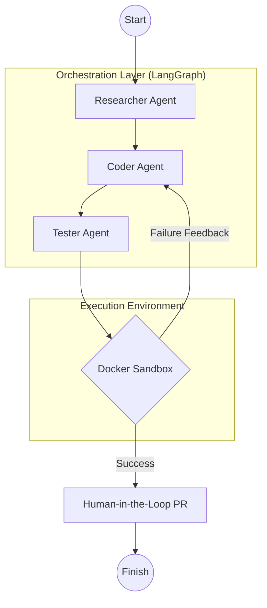

<p align="center">
  
</p>

<div align="center">
  
  
  
  
  <a href="https://www.gnu.org/licenses/agpl-3.0"></a>
</div>

---

<div align="center">
  <h3>Autonomous Multi-Agent Orchestrator For GitHub Issues</h3>
  <a href="https://github.com/NinadAmane/Ghost-Coder">
    
  </a>
</div>


---

**Imagine this:** You paste a GitHub Issue link into a dashboard and sip your coffee. While you watch, an AI autonomously clones your repository, hunts down the exact file causing the bug, and writes the fix. But it doesn't stop there—it spins up an isolated Docker sandbox, runs your tests to prove the fix works, and automatically opens a Pull Request for your review. 

That is **Ghost Coder**. It's not just a chat wrapper; it's a relentless, autonomous software engineer that handles the mundane debugging so you can focus on building.

---

## 📑 Table of Contents

- [⚡ Quick Start & Installation](#-quick-start--installation)
- [🏗️ System Architecture](#-system-architecture)
- [🛠️ Technology Stack](#-technology-stack)
- [🌱 Env Variables](#-env-variables)
- [👨‍💻 Developers & Troubleshooting](#-developers--troubleshooting)
- [🙌 Contributing](#-contributing)
- [📄 License](#-license)

---

## ⚡ Quick Start & Installation

### Prerequisites
- Python 3.11+
- [Docker Desktop](https://www.docker.com/products/docker-desktop/) installed and running
- Groq API Key and GitHub PAT

### Installation
Ghost Coder supports installation via [uv](https://github.com/astral-sh/uv) (recommended for speed) or standard `pip`.

1. **Clone the repository**
   ```bash
   git clone https://github.com/NinadAmane/Ghost-Coder.git
   cd Ghost-Coder
   ```

2. **Install dependencies**

   **Using uv (Recommended):**
   ```bash
   uv sync
   source .venv/bin/activate  # Windows: .venv\Scripts\activate
   ```

   **Alternative using standard pip:**
   ```bash
   python -m venv .venv
   source .venv/bin/activate  # Windows: .venv\Scripts\activate
   pip install -e .[dev]
   ```

---

## 🏗️ System Architecture

Ghost Coder is built on a modular, multi-agent state-machine architecture powered by **LangGraph**. The workflow acts as a living cycle where agents collaborate, test, and loop until a solution is mathematically validated.



---

## 🛠️ Technology Stack

| Component           | Technology                       | Function                                    |
| :------------------ | :------------------------------- | :------------------------------------------ |
| **Brain**           | Groq (`llama-3.3-70b-versatile`) | High-speed reasoning and code generation    |
| **Orchestration**   | LangGraph & LangChain            | Multi-agent state machine looping           |
| **Frontend**        | Streamlit                        | Live, streaming agent-thought UI            |
| **Sandbox**         | Docker SDK                       | Secure, dependency-aware code execution    |
| **Version Control** | PyGithub & Git                   | Automated branch and Pull Request creation  |
| **CI/CD**           | GitHub Actions                   | Automated Pytest validation & Docker builds |

---

## 🌱 Env Variables

The following environment variables are required for full functionality. You can input them in the Streamlit Sidebar or set them in a `.env` file at the root of the project.

| Variable | Description | Source |
| :--- | :--- | :--- |
| `GROQ_API_KEY` | API Key for Llama-3 reasoning | [Groq Console](https://console.groq.com/keys) |
| `GITHUB_TOKEN` | Personal Access Token for repo access | [GitHub Settings](https://github.com/settings/tokens) |

---

## 👨‍💻 Developers & Troubleshooting

### Running Tests
To ensure the sandbox and core tools are functioning correctly, run the test suite:
```bash
pytest tests/
```

<details>
<summary>⚠️ Troubleshooting Common Errors</summary>

**Docker Connection Refused**
Ensure Docker Desktop is running and the Docker daemon is accessible to your terminal.

**ModuleNotFoundError in Sandbox**
If the agent fails to find a library (like pandas), ensure the target repository has a `requirements.txt`. The Docker Sandbox will automatically parse it and install dependencies before running the test.

**Groq Rate Limits**
If you encounter `429 Too Many Requests`, the system will automatically retry, but you may need to check your Groq usage tier.
</details>

---

## 🙌 Contributing

We welcome contributions! Please see our contributing guidelines for more details.

### Contributors
<a href="https://github.com/NinadAmane/Ghost-Coder/graphs/contributors">
  
</a>

---

## 📄 License
This project is licensed under the **MIT License**. See the [LICENSE](LICENSE) file for details.

---

## 🤝 Credits
Architected by **Ninad Amane**.
